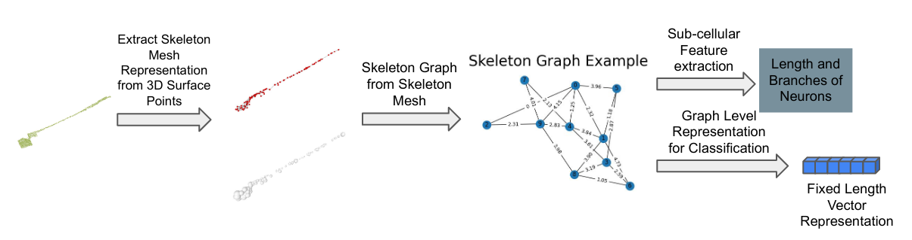

# Neuron-Morphology
This repo contains the source code for the paper "Neuron Morphology Analysis". We specifically use it for Ciona neuron morphology analysis. You can modify it for more general cases.

This neuron morphology analysis contains: shape representation from surface point clouds, sub-cellular feature extraction, shape embeding, and classification.

## Code
### Installation
- You need to install pytorch, pytorch_geometric, open3d, NAVIS, scikit-learn, PointNet++ (see install instructions [here](https://github.com/clinplayer/Point2Skeleton))
### Preprocess
- Get ply surface point clouds from Reconstruct software series files
- Sample the skeleton points to a fixed number by running "python makesurface.py". 
- You can change the number of points you want in makesurface.py
- Sampled surface point clouds are avaiable [here](https://drive.google.com/drive/folders/192JTQuIZExsqSW03qAD0jxdksGviyEyS)
### skeleton mesh generation
- To test the existing model, cd into skeleton_mesh_generation/code
- Run "python test.py --pc_list_file ../../cells_skel_input_detail_norm.txt --data_root ../../ --point_num 2000 --skelpoint_num 100 --gpu 1 --load_skelnet_path ../weights_with_norm/weights-skelpoint.pth --load_gae_path ../weights_with_norm/weights-gae.pth --save_result_path ../results_with_norm/ "
- Skeleton meshes for Ciona neurons are avaiable [here](https://drive.google.com/drive/folders/1nQvnwj2A1UvVclK3R9Y50ZGZ0Cj8D1RP)
- To train the model, cd into skeleton_mesh_generation/code
- Run "python3 train.py --pc_list_file ../../cells_skel_input_detail_norm.txt --data_root ../../train_data/ --point_num 2000 --skelpoint_num 100 --gpu 0 --save_net_path ../weights_with_norm/"
### skeleton graph embedding
- cd into SkeletonGraph_Embed folder
- Run "ciona_data.py" to get the necessary graph representation to the embedding network
- Run "python main.py --DS neuron2 --lr 0.001 --num-gc-layers 3 --hidden-dim 128"
### classfication and pairwise distance
- cd into classification/skeleton2graph folder
- Run "distance_cluster.py" and "knn_spectrum_cluster.py" to get the pairwise distance and classification results separately

The code is partially referenced from [here](https://github.com/fanyun-sun/InfoGraph) and [here](https://github.com/clinplayer/Point2Skeleton)
